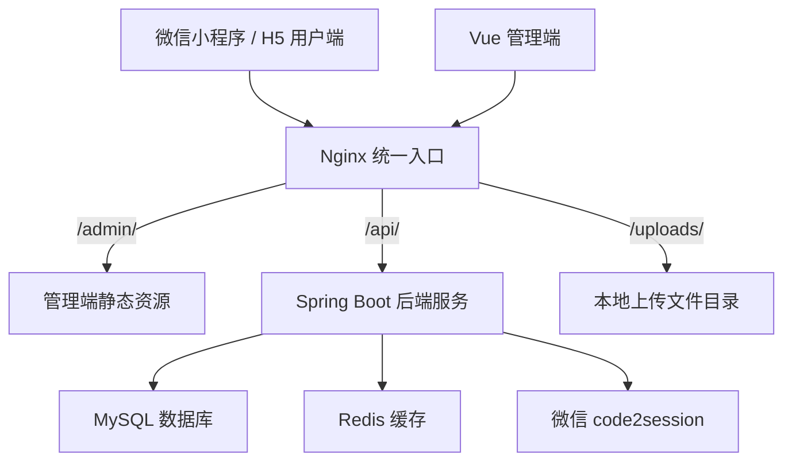
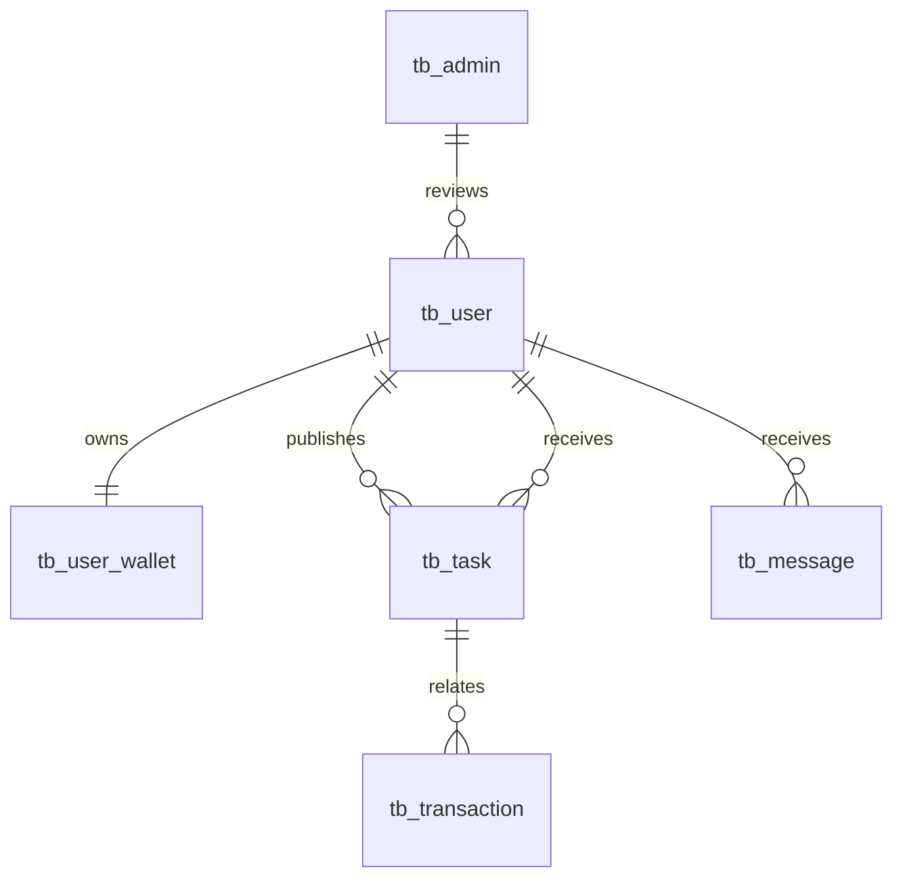
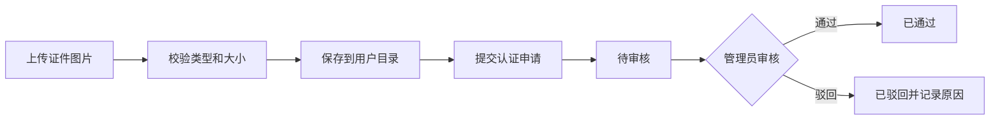
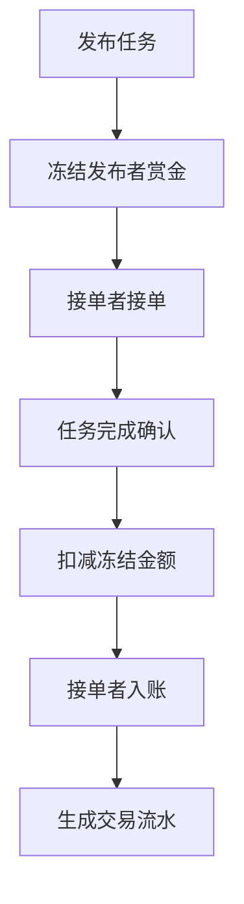

# 基于 Java 的校园跑腿接单与配送系统答辩版

> 适用场景：毕业设计答辩、课程设计答辩、项目验收汇报。  
> 建议时长：8-12 分钟。  
> 建议页数：16-20 页。  
> 汇报风格：先讲问题与目标，再讲系统设计，重点突出核心业务闭环、技术实现和测试部署结果。

## 一、答辩整体思路

本项目答辩不建议只按“我做了哪些页面”来讲，因为页面展示容易显得像普通功能堆砌。更合适的主线是：

1. 校园跑腿场景存在真实需求。
2. 传统社群委托方式缺少任务追踪、身份可信和账务闭环。
3. 本系统用微信小程序 + 管理端 + 后端服务，把任务流、资金流、审核流和消息流统一起来。
4. 系统不仅能演示，还补充了生产部署、安全配置、真实微信登录、增量数据库迁移等上线能力。

答辩时建议反复强调三句话：

第一，系统解决的是校园内跑腿需求撮合与流程管理问题。  
第二，系统核心价值不只是发布任务，而是形成任务、钱包、审核和通知的完整闭环。  
第三，系统采用前后端分离架构，具备小规模生产部署能力，后续可扩展支付、对象存储和智能调度。

## 二、PPT 页面结构

### 第 1 页 封面

**页面标题**  
基于 Java 的校园跑腿接单与配送系统设计与实现

**页面内容**

- 学生姓名
- 学号
- 专业班级
- 指导教师
- 答辩日期

**讲稿示例**

各位老师好，我的论文题目是《基于 Java 的校园跑腿接单与配送系统设计与实现》。本系统面向高校校园内取快递、代买物品、资料递送等生活服务需求，设计并实现了一个包含微信小程序用户端、Web 管理端和 Java 后端服务的校园跑腿平台。接下来我将从研究背景、需求分析、系统设计、关键实现、测试部署和总结展望几个方面进行汇报。

### 第 2 页 汇报目录

**页面标题**  
汇报目录

**页面内容**

1. 研究背景与意义
2. 系统需求分析
3. 总体架构设计
4. 核心功能实现
5. 数据库与安全设计
6. 测试与部署
7. 总结与展望

**讲稿示例**

本次汇报主要分为七个部分。首先介绍为什么要做校园跑腿系统，然后分析系统需求和业务规则；接着介绍系统的总体架构和数据库设计；之后重点说明微信登录、实名认证、任务账务闭环和后台管理等关键模块；最后介绍测试部署情况以及系统不足和后续优化方向。

### 第 3 页 研究背景

**页面标题**  
研究背景：校园即时服务需求增加

**页面内容**

- 高校学生存在高频跑腿需求：取快递、代买、打印资料、临时递送。
- 传统处理方式依赖微信群、熟人委托和线下沟通。
- 传统方式存在信息分散、任务状态不透明、资金缺少约束、纠纷难追溯等问题。
- 微信小程序入口轻、使用成本低，适合校园服务场景。

**建议图表**

可以放一张“传统模式问题”对比图：

| 传统方式 | 存在问题 |
| --- | --- |
| 微信群发需求 | 信息容易刷屏、难搜索 |
| 熟人帮忙 | 服务范围有限 |
| 线下付款 | 金额和责任不清 |
| 口头确认 | 任务状态难追踪 |

**讲稿示例**

校园内部空间相对集中，学生群体也比较固定，因此跑腿服务具有天然需求。但目前很多需求仍然通过微信群或熟人委托完成。这种方式虽然简单，但信息容易被刷掉，任务是否被接单、是否送达、费用如何结算都缺少统一记录。因此，我设计这个系统的出发点，就是把校园内分散的跑腿需求平台化，使任务发布、接单、配送、完成和结算都能够被系统记录和管理。

### 第 4 页 研究意义

**页面标题**  
研究意义：从信息撮合到业务闭环

**页面内容**

- 对用户：降低发布和接单成本，提高校园生活便利性。
- 对平台：统一管理任务、用户、钱包和消息。
- 对交易：通过冻结、流水、审核降低资金纠纷。
- 对工程实践：覆盖前后端分离、微信登录、文件上传、WebSocket、Docker 部署等技术点。

**讲稿示例**

本系统的意义主要体现在两个层面。从业务层面看，它把原本分散在社群里的跑腿需求变成了可查询、可追踪、可结算的业务流程。从技术层面看，系统不是单一页面展示，而是包含微信小程序端、后台管理端、后端接口、数据库、文件上传、实时消息和生产部署的一套完整 Web 应用，能够体现较完整的软件工程实践过程。

### 第 5 页 系统目标

**页面标题**  
系统建设目标

**页面内容**

本系统目标是实现一个面向小规模校园上线的跑腿服务平台：

- 用户端支持微信登录、实名认证、任务发布、任务接单、钱包和消息。
- 管理端支持用户管理、实名审核、任务管理、钱包提现审核和系统配置。
- 后端提供统一 API、JWT 认证、WebSocket 消息和数据库持久化。
- 部署上支持单台云服务器、同域名路径部署。

**讲稿示例**

系统目标可以概括为“一个用户端、一个管理端、一个后端服务和一套部署方案”。用户端主要服务学生用户，管理端主要服务平台管理员，后端负责业务逻辑和数据持久化。系统最终不是只停留在本地演示，而是补充了生产配置、Nginx 规则、Docker Compose 和增量 SQL，能够支持单台服务器的小规模上线。

### 第 6 页 需求分析

**页面标题**  
功能需求分析

**页面内容**

| 角色 | 核心需求 |
| --- | --- |
| 普通用户 | 登录、实名、发布任务、查看订单、钱包管理 |
| 接单用户 | 浏览任务、接单、配送、获取收入 |
| 管理员 | 审核实名、处理提现、管理任务、维护配置 |

**页面补充**

- 同一个学生既可以发布任务，也可以接单。
- 管理员负责处理异常状态和人工审核。
- 钱包模块是任务流程可信的基础。

**讲稿示例**

系统中主要有三个角色：普通用户、接单用户和管理员。普通用户关注的是能否方便发布任务并追踪状态；接单用户关注的是能否找到合适任务并获得收入；管理员关注的是平台是否可管理、异常是否可处理。需要说明的是，普通用户和接单用户不是两个完全独立账号，一个学生既可以发布任务也可以接单，系统通过任务状态和业务规则控制具体操作。

### 第 7 页 非功能需求

**页面标题**  
非功能需求分析

**页面内容**

- 安全性：JWT 认证、管理员角色隔离、BCrypt 密码、敏感配置环境变量化。
- 可靠性：钱包冻结、条件更新、交易流水、任务结算幂等。
- 可维护性：后端分层结构，前后端接口解耦。
- 可部署性：支持 `/admin/`、`/api/`、`/uploads/` 同域名部署。
- 可扩展性：后续可接微信支付、对象存储、智能调度和监控告警。

**讲稿示例**

除了功能需求，系统还重点考虑了安全性和可靠性。因为跑腿业务涉及余额冻结、提现和任务结算，如果只实现页面功能而不处理账务一致性，很容易产生纠纷。因此系统通过钱包冻结、交易流水和幂等判断来保证资金变化可追踪。同时，生产环境敏感配置全部外置，管理员密码使用 BCrypt 加密存储，避免默认账号和明文密码风险。

### 第 8 页 总体架构

**页面标题**  
系统总体架构

**页面内容**

**讲稿示例**

系统采用前后端分离架构。用户端使用 Uniapp 开发，可以运行在微信小程序和 H5；管理端使用 Vue 3 和 Ant Design Vue；后端使用 Spring Boot 提供 REST API 和 WebSocket 服务；数据层使用 MySQL 和 Redis。部署时 Nginx 作为统一入口，管理端走 `/admin/`，后端接口走 `/api/`，上传文件走 `/uploads/`。这种设计使用户端、管理端和后端服务可以独立构建和维护。

### 第 9 页 技术选型

**页面标题**  
技术选型与原因

**页面内容**

| 层级 | 技术 | 选择原因 |
| --- | --- | --- |
| 后端框架 | Spring Boot | 开发效率高，生态成熟 |
| ORM | MyBatis-Plus | 简化 CRUD 和分页查询 |
| 数据库 | MySQL 8.0 | 适合结构化业务数据 |
| 缓存 | Redis | 可用于缓存和会话扩展 |
| 认证 | JWT | 适合前后端分离无状态认证 |
| 用户端 | Uniapp | 一套代码支持小程序/H5 |
| 管理端 | Vue 3 + Ant Design Vue | 组件成熟，适合后台系统 |
| 部署 | Nginx + Docker Compose | 适合单机上线和服务编排 |

**讲稿示例**

技术选型上，我优先选择成熟稳定、学习成本适中、适合中小型项目的技术。Spring Boot 负责后端快速开发，MyBatis-Plus 简化数据库访问，JWT 用于无状态认证。用户端采用 Uniapp 是因为它能够构建微信小程序，符合校园用户的使用习惯。管理端使用 Vue 3 和 Ant Design Vue，可以快速构建后台表格、表单和审核页面。部署方面使用 Nginx 和 Docker Compose，方便在单台云服务器上组织多个服务。

### 第 10 页 后端分层设计

**页面标题**  
后端分层设计

**页面内容**

| 层级 | 职责 |
| --- | --- |
| Controller | 接收请求、参数校验、返回统一结果 |
| Service | 实现核心业务逻辑和事务控制 |
| Mapper | 完成数据库访问 |
| Entity/DTO | 映射数据表和接口请求对象 |
| Config | 跨域、拦截器、WebSocket、启动初始化 |
| Common/Util | JWT、响应封装、通用工具 |

**讲稿示例**

后端采用典型的分层结构。Controller 层只负责接收请求和返回结果，具体业务逻辑放在 Service 层。比如任务取消时要同时更新任务、钱包、流水和消息，这些逻辑都放在 Service 层，并通过事务保证一致性。Mapper 层负责数据库访问，Entity 和 DTO 分别用于数据库映射和接口参数传递。这样的结构降低了模块耦合，也方便后续维护和测试。

### 第 11 页 数据库设计

**页面标题**  
核心数据库设计

**页面内容**

| 表名 | 作用 |
| --- | --- |
| tb_user | 用户信息和实名认证状态 |
| tb_user_wallet | 钱包余额、冻结金额和版本号 |
| tb_transaction | 充值、提现、支付、收入和退款流水 |
| tb_task | 跑腿任务信息和状态 |
| tb_evaluation | 任务评价 |
| tb_message | 系统通知 |
| tb_admin | 管理员账号 |
| tb_config | 系统配置 |

**建议图示**

**讲稿示例**

数据库设计围绕用户、任务和钱包展开。用户表保存基础信息和实名认证状态；钱包表保存余额和冻结金额；交易流水表记录每一次资金变化；任务表记录发布者、接单者、任务内容、赏金和状态。通过这些表之间的关联，系统可以追踪一个任务从发布到完成的完整过程，也可以追踪每一笔资金变化的来源。

### 第 12 页 微信登录实现

**页面标题**  
关键实现一：真实微信登录

**页面内容**

登录流程：

1. 小程序调用微信接口获取临时 code。
2. 前端提交 code 到后端。
3. 后端使用 appid 和 secret 调用 `code2session`。
4. 微信返回 openid、unionid、session_key。
5. 后端创建或查询用户，并初始化钱包。
6. 后端签发 JWT，前端保存 Token。

**页面亮点**

- 生产环境关闭 mock 登录。
- 微信 appid/secret 通过环境变量配置。
- Token 中区分用户角色和管理员角色。

**讲稿示例**

登录模块从原来的演示登录改成了真实微信登录。小程序端先获取 code，后端再调用微信官方的 code2session 接口换取 openid。openid 是识别小程序用户身份的关键字段。系统根据 openid 判断用户是否已存在，如果是新用户，则自动创建用户和钱包。最后后端签发 JWT，前端后续请求都携带这个 Token。生产环境下不再保留 mock 登录入口，从而提高上线安全性。

### 第 13 页 实名认证实现

**页面标题**  
关键实现二：实名认证与人工审核

**页面内容**

**页面亮点**

- 限制上传图片类型和大小。
- 证件图按用户目录隔离。
- 管理端支持列表、预览、通过、驳回。
- 用户端可查询审核状态。

**讲稿示例**

实名认证模块采用人工审核方式。用户端先上传证件图片，后端会校验文件类型和大小，防止上传非图片文件。文件保存时按用户目录隔离，并返回 `/uploads/...` 路径。用户提交认证后状态变为待审核，管理员可以在后台查看图片并进行通过或驳回。驳回时系统会记录原因，用户端可以看到状态并重新提交。

### 第 14 页 钱包账务闭环

**页面标题**  
关键实现三：钱包与任务账务闭环

**页面内容**

**页面亮点**

- `availableBalance = balance - frozenAmount`
- 冻结、解冻、扣款、入账统一走服务层。
- 任务完成结算增加幂等保护。
- 管理员取消任务会释放冻结金额并生成退款流水。
- 提现为待处理申请，由管理员审核。

**讲稿示例**

钱包模块是本系统的重点。跑腿任务不是简单修改任务状态，而是和资金变化绑定。发布任务时，系统会冻结发布者的赏金，保证任务完成后有资金可以结算。任务完成后，系统从冻结金额中扣款，并给接单者入账，同时生成交易流水。如果管理员取消任务，系统会释放冻结金额并生成退款流水。为了避免重复点击或网络重试导致重复结算，系统还增加了幂等判断。

### 第 15 页 任务状态流转

**页面标题**  
关键实现四：任务状态流转控制

**页面内容**

| 当前状态 | 操作 | 下一状态 | 资金处理 |
| --- | --- | --- | --- |
| 待接单 | 用户接单 | 已接单/配送中 | 无新增资金变化 |
| 待接单 | 管理员取消 | 已取消 | 解冻赏金 |
| 配送中 | 确认完成 | 已完成 | 扣款并入账 |
| 配送中 | 管理员取消 | 已取消 | 按规则退款 |
| 已完成 | 重复结算 | 已完成 | 幂等返回 |

**讲稿示例**

任务状态流转用于保证业务流程合法。只有待接单任务可以被接单，只有进行中的任务可以完成，已完成任务不能重复结算，已取消任务不能继续操作。管理员取消任务时，系统不仅更新任务状态，还会处理钱包冻结金额、交易流水和消息通知。这样可以避免任务状态和资金状态不一致。

### 第 16 页 管理端设计

**页面标题**  
管理端功能设计

**页面内容**

- 登录：数据库管理员账号 + BCrypt 密码。
- 仪表盘：展示用户、任务、交易等统计数据。
- 用户管理：查看用户信息和状态。
- 实名审核：查看证件图，通过或驳回。
- 任务管理：查看任务列表，处理异常任务。
- 钱包管理：查看流水，审核提现。
- 系统设置：维护基础配置、任务规则和协议内容。

**讲稿示例**

管理端主要用于平台运营。管理员账号不再使用代码里的默认账号，而是保存在数据库中，密码经过 BCrypt 加密。管理端除了常规的用户和任务管理，还重点支持实名认证审核和提现审核。因为这两个功能都涉及平台风险控制，需要管理员人工判断。系统设置模块则用于维护一些基础配置，方便后续运营调整。

### 第 17 页 生产部署设计

**页面标题**  
生产部署与上线能力

**页面内容**

| 路径 | 作用 |
| --- | --- |
| `/admin/` | 管理端静态页面 |
| `/api/` | 后端 API |
| `/api/ws/message` | WebSocket 消息 |
| `/uploads/` | 上传文件访问 |

**页面补充**

- 增加 `prod` profile。
- 敏感配置使用环境变量。
- 提供 Dockerfile、Nginx 配置、Docker Compose。
- 数据库升级使用增量 SQL，不清空现有数据。

**讲稿示例**

为了让系统具备上线能力，我增加了生产环境配置和部署文件。生产部署采用同域名路径方式，管理端通过 `/admin/` 访问，后端接口通过 `/api/` 访问，上传文件通过 `/uploads/` 访问。敏感配置不写入代码，而是通过环境变量传入。数据库改动使用增量 SQL，避免上线时清空已有数据。这些设计使系统从演示项目进一步接近可部署项目。

### 第 18 页 测试结果

**页面标题**  
系统测试与验证

**页面内容**

| 测试项 | 命令或方式 | 结果 |
| --- | --- | --- |
| 后端单元测试 | `mvn test` | 通过 |
| 管理端生产构建 | `pnpm run build` | 通过 |
| 用户端 H5 构建 | `npm run build:h5` | 通过 |
| 实名认证链路 | 上传、提交、审核 | 待部署验收 |
| 任务账务链路 | 发布、接单、完成、退款 | 待部署验收 |

**讲稿示例**

当前系统已经通过后端单元测试、管理端生产构建和用户端 H5 构建。后端测试覆盖了异常处理、微信登录服务、文件上传服务和任务服务等内容。需要说明的是，真实微信登录、HTTPS 域名和 Nginx 代理依赖生产服务器环境，因此上线前还需要在真实服务器上完成部署验收和主链路手工测试。

### 第 19 页 项目特色与创新点

**页面标题**  
项目特色

**页面内容**

1. 业务闭环完整：任务发布、接单、完成、结算、退款、通知形成闭环。
2. 钱包设计更贴近真实业务：区分余额、冻结金额和可用余额。
3. 生产安全意识较强：真实微信登录、管理员数据库账号、环境变量配置。
4. 后台审核能力完整：实名认证审核和提现审核均有管理端支持。
5. 部署方案明确：支持单台服务器、同域名路径、Nginx 和 Docker Compose。

**讲稿示例**

本项目的特点不只是实现了一个跑腿小程序，而是围绕真实上线场景做了较多完善。比如钱包不是简单的余额加减，而是引入冻结金额和交易流水；登录不是本地模拟，而是接入真实微信 code2session；管理端也不只是展示列表，而是支持实名认证和提现审核。同时系统补充了 Docker 和 Nginx 部署方案，具备进一步上线验证的基础。

### 第 20 页 总结与展望

**页面标题**  
总结与展望

**页面内容**

**总结**

- 完成校园跑腿系统的需求分析、设计、实现和测试。
- 实现用户端、管理端和后端服务。
- 打通任务流、资金流、审核流和消息流。
- 具备小规模生产部署基础。

**不足**

- 尚未接入真实微信支付。
- 文件存储仍为服务器本地目录。
- 实名认证为人工审核。
- 自动化测试覆盖还可继续提升。

**展望**

- 接入微信支付和对象存储。
- 增加信用评分和风控规则。
- 引入监控告警和 CI/CD。
- 扩展智能调度和路线推荐。

**讲稿示例**

总体来说，本系统完成了校园跑腿业务从需求分析到系统实现的主要工作，实现了用户端、管理端和后端服务，并重点打通了任务和钱包的业务闭环。当然系统仍然有不足，比如还没有接入真实支付，文件存储也还停留在本地目录。后续可以继续接入微信支付、对象存储、信用评分和监控告警，使系统具备更强的生产运行能力。我的汇报到此结束，请各位老师批评指正。

## 三、现场演示建议

如果答辩允许现场演示，建议控制在 2-3 分钟，不要把每个页面都点一遍。推荐演示顺序如下：

1. 打开小程序用户端，展示首页和任务列表。
2. 展示发布任务页面，说明发布任务会冻结钱包余额。
3. 展示钱包页面，说明余额、冻结金额和可用余额。
4. 展示实名认证页面，说明上传和审核状态。
5. 切换管理端，展示实名审核列表和提现审核。
6. 展示任务管理页面，说明管理员可处理异常任务。

演示时要避免临场录入大量数据。建议提前准备好测试账号、测试任务和测试认证记录。现场只演示关键操作和结果，不做长流程等待。

## 四、答辩讲稿完整版

各位老师好，我的论文题目是《基于 Java 的校园跑腿接单与配送系统设计与实现》。本系统主要面向高校校园内取快递、代买物品、打印资料、临时递送等生活服务需求，设计并实现了一个包含微信小程序用户端、Web 管理端和 Java 后端服务的校园跑腿平台。

首先介绍研究背景。高校校园具有用户集中、服务半径较小、即时需求频繁等特点。学生日常经常会有取快递、代买、帮送资料等需求。传统方式通常依赖微信群或熟人委托，这种方式虽然简单，但存在信息容易丢失、任务状态不透明、费用结算缺少约束、纠纷难以追溯等问题。因此，我希望通过系统化平台把这些跑腿需求统一管理起来。

本系统的研究意义主要体现在两个方面。从业务角度看，系统可以降低学生发布和承接跑腿任务的成本，使任务从发布、接单、配送到完成确认都有记录。从工程实践角度看，本系统覆盖了前后端分离、微信登录、JWT 认证、数据库设计、文件上传、WebSocket 消息、Docker 部署等技术点，是一个相对完整的软件系统实践。

在需求分析方面，系统主要包含三个角色：普通用户、接单用户和管理员。普通用户可以登录、实名、发布任务、查看钱包和任务状态；接单用户可以浏览任务、接单并获得收入；管理员可以审核实名认证、处理提现申请、管理任务和维护系统配置。由于同一个学生既可能发布任务，也可能接单，所以用户端没有把普通用户和接单用户设计成两个完全独立的账号，而是通过任务状态和业务规则控制操作。

在总体架构方面，系统采用前后端分离架构。用户端采用 Uniapp 开发，可构建为微信小程序和 H5；管理端采用 Vue 3 和 Ant Design Vue；后端采用 Spring Boot、MyBatis-Plus、MySQL、Redis、JWT 和 WebSocket。部署时使用 Nginx 作为统一入口，管理端访问路径为 `/admin/`，后端接口路径为 `/api/`，上传文件通过 `/uploads/` 暴露，WebSocket 通过 `/api/ws/message` 连接。

后端采用分层设计，Controller 层负责请求接收和响应封装，Service 层负责核心业务逻辑，Mapper 层负责数据库访问，Entity 和 DTO 分别用于数据库映射和接口参数传递。这样的设计可以降低模块耦合，提高后续维护和扩展的便利性。

数据库设计围绕用户、任务和钱包展开。核心表包括用户表、用户钱包表、交易流水表、任务表、评价表、消息表、管理员表和配置表。其中钱包表保存余额、冻结金额和版本号；交易流水表记录充值、提现、任务支付、任务收入和退款等资金变化；任务表记录发布者、接单者、任务内容、赏金和状态。通过这些表之间的关联，系统可以追踪任务和资金的完整流转过程。

接下来介绍几个关键实现。第一个是微信登录模块。小程序端获取临时 code 后提交给后端，后端调用微信 code2session 接口换取 openid。系统根据 openid 查询或创建用户，并初始化钱包，最后签发 JWT 返回前端。生产环境中关闭模拟登录能力，微信 appid 和 secret 通过环境变量配置。

第二个是实名认证模块。用户上传身份证或学生证明图片时，后端会校验文件类型和大小，只允许上传常见图片格式。文件保存到服务器上传目录，并按用户编号进行目录隔离。用户提交认证后状态变为待审核，管理员可以在后台查看图片并进行通过或驳回。驳回时系统会记录原因，用户端可以查询最新审核状态。

第三个是钱包与任务账务闭环。发布任务时，系统先判断用户可用余额是否充足，然后冻结任务赏金。任务完成确认后，系统从发布者冻结金额中扣款，并给接单者钱包入账，同时生成交易流水。如果管理员取消任务，系统会释放冻结金额、生成退款流水并通知相关用户。为了避免重复点击或接口重试导致重复结算，系统在任务完成结算时加入了幂等判断。

第四个是管理端。管理端账号不再使用代码中的默认账号，而是保存到数据库，密码使用 BCrypt 加密。管理端支持用户管理、任务管理、实名认证审核、钱包提现审核、系统配置和数据看板。实名认证审核和提现审核是管理端的重点功能，因为它们直接关系到平台风险控制和业务可信度。

在部署方面，系统增加了生产环境 profile，数据库、Redis、JWT 密钥、微信 appid 和 secret、上传目录、管理员初始账号等敏感信息都通过环境变量配置。系统提供 Dockerfile、Nginx 配置、Docker Compose 文件和增量 SQL。数据库升级采用增量迁移方式，不需要清空已有数据。

在测试方面，后端执行了 `mvn test`，测试通过；管理端执行了 `pnpm run build`，生产构建通过；用户端执行了 `npm run build:h5`，构建通过。后端测试覆盖了全局异常处理、微信登录服务、文件上传服务和任务服务。需要说明的是，真实微信登录和 HTTPS 域名配置依赖生产环境，因此上线前还需要在真实服务器上进行完整部署验收。

本项目的特色主要有五点。第一，业务闭环比较完整，不只是任务发布，还包括接单、完成、钱包结算、退款和通知。第二，钱包设计区分余额、冻结金额和可用余额，更接近真实业务。第三，生产安全能力有所加强，包括真实微信登录、管理员数据库账号和环境变量配置。第四，后台审核能力较完整，包括实名认证和提现审核。第五，部署方案明确，支持单台服务器同域名路径部署。

最后总结一下。本系统完成了校园跑腿业务的需求分析、设计、实现和测试，实现了用户端、管理端和后端服务，并打通了任务流、资金流、审核流和消息流。系统仍然存在一些不足，比如尚未接入真实微信支付，文件存储仍为服务器本地目录，实名认证仍是人工审核。后续可以继续接入微信支付、对象存储、信用评分、监控告警和智能调度，使系统更加完善。

我的汇报到此结束，请各位老师批评指正。

## 五、答辩可能提问与参考回答

### 1. 为什么选择微信小程序作为用户端？

因为校园跑腿服务具有轻量、高频、即时的特点，微信小程序无需安装独立 App，用户进入成本低，也便于使用微信登录获取用户身份。对于校园场景来说，小程序比传统 Web 或独立 App 更适合快速使用和推广。

### 2. 你的系统和微信群跑腿有什么区别？

微信群只能完成信息发布，缺少统一的任务状态管理、资金约束、实名认证和后台审核。本系统能够记录任务从发布、接单、配送到完成的全过程，并通过钱包冻结和交易流水保证资金变化可追踪，同时管理员可以处理异常任务和审核用户。

### 3. 为什么钱包要设计冻结金额？

如果没有冻结金额，用户发布任务后可能把余额提现或用于其他任务，导致任务完成后无法结算。冻结金额可以在任务发布时锁定对应赏金，任务完成后再扣款并给接单者入账，任务取消时再解冻，从而保证账务闭环。

### 4. 如何避免任务重复结算？

系统在任务完成结算前会检查任务状态和相关交易流水。如果任务已经完成或已经存在对应收入流水，则不会重复生成流水和重复入账。这种幂等保护可以避免用户重复点击、网络重试或接口重复调用造成的资金错误。

### 5. 为什么不直接接入微信支付？

本系统当前定位为小规模校园上线版本，重点先完成任务和钱包的业务闭环。微信支付涉及商户号、资质、回调验签、退款接口和对账等复杂流程，因此本阶段采用虚拟余额和人工提现方式。后续系统可以在当前钱包流水基础上扩展微信支付。

### 6. 实名认证为什么采用人工审核？

第三方实名核验通常需要额外资质和费用。对于小规模校园场景，人工审核可以满足初期需求，也便于管理员结合学生证、身份证图片和用户信息进行判断。系统已经预留了认证状态和审核字段，后续可以扩展第三方实名接口。

### 7. 上传证件图片是否安全？

当前系统限制上传文件类型和大小，并按用户目录隔离保存，生产环境通过 `/uploads/` 暴露访问。由于证件图属于敏感信息，后续还可以进一步增加访问鉴权、脱敏显示、水印和对象存储私有桶，提高安全性。

### 8. 管理员密码如何保证安全？

管理员账号保存在数据库中，密码不使用明文存储，而是使用 BCrypt 哈希算法。BCrypt 自带随机盐并且计算成本可调，即使数据库泄露，也比明文密码更安全。同时生产环境不再展示默认账号密码。

### 9. JWT 有什么作用？

JWT 用于前后端分离场景下的无状态身份认证。用户或管理员登录成功后，后端签发 Token，前端后续请求在请求头中携带 Token。后端解析 Token 后识别用户身份和角色，从而判断是否允许访问对应接口。

### 10. 系统如何部署？

系统支持单台云服务器部署。使用 Docker Compose 编排 MySQL、Redis、后端服务和 Nginx。Nginx 作为统一入口，`/admin/` 访问管理端，`/api/` 代理后端接口，`/uploads/` 暴露上传文件，WebSocket 使用 `/api/ws/message`。

### 11. Redis 在系统中有什么作用？

当前系统主要使用 Redis 作为缓存和后续扩展基础。它可以用于存储热点配置、验证码、短期会话状态或限流计数等。虽然核心业务数据仍然保存在 MySQL 中，但 Redis 可以提升后续系统性能和扩展能力。

### 12. 你的系统有哪些不足？

主要不足包括：没有接入真实微信支付，提现仍需要人工审核；文件存储使用服务器本地目录，扩展性和灾备能力有限；实名认证仍是人工审核；自动化测试覆盖还可以继续提高；高并发和大规模运营能力还需要进一步验证。

### 13. 如果用户量增加，系统如何扩展？

可以从几个方面扩展：后端服务改为多节点部署并通过 Nginx 负载均衡；上传文件迁移到对象存储；Redis 用于缓存热点数据和分布式锁；数据库进行索引优化和读写分离；接入监控告警和日志平台，提高运维能力。

### 14. 任务取消时为什么要生成退款流水？

退款流水可以记录资金变化原因，便于用户查看，也便于平台审计。如果只是简单解冻金额而不记录流水，用户和管理员很难追踪一笔资金为什么恢复。因此取消任务时生成退款流水可以提高账务透明度。

### 15. 你的系统创新点在哪里？

本系统的创新点主要是结合校园场景实现了较完整的业务闭环。它不是单纯的信息发布系统，而是把任务状态、钱包冻结、交易流水、实名认证审核、提现审核和消息通知组合起来。同时系统还考虑了生产部署和安全配置，更接近真实可上线系统。

## 六、答辩前准备清单

| 检查项 | 建议 |
| --- | --- |
| PPT 页数 | 控制在 16-20 页 |
| 汇报时间 | 提前练习，控制在 8-12 分钟 |
| 演示账号 | 准备至少 2 个用户账号和 1 个管理员账号 |
| 测试数据 | 准备待审核实名、待接单任务、待处理提现 |
| 截图材料 | 准备小程序首页、钱包页、管理端审核页、任务管理页 |
| 备份方案 | 如果现场网络失败，使用截图继续讲 |
| 高频问题 | 熟悉钱包冻结、JWT、微信登录、部署方式 |
| 论文一致性 | 答辩内容要和论文正文保持一致 |

## 七、PPT 制作建议

为了让答辩更像正式项目汇报，PPT 视觉上建议：

1. 每页标题不超过 16 个字，避免一页放太多正文。
2. 代码截图少放，除非老师要求看关键实现。
3. 重点放流程图、架构图、数据库关系图和功能截图。
4. 钱包账务闭环单独做一页，这是系统亮点。
5. 测试结果不要只写“通过”，要说明测试了什么。
6. 总结页要同时讲成果和不足，显得客观可信。

建议页面比例：

| 内容类型 | 页数 |
| --- | --- |
| 背景与需求 | 4-5 页 |
| 架构与设计 | 4-5 页 |
| 关键实现 | 5-6 页 |
| 测试与部署 | 2-3 页 |
| 总结展望 | 1-2 页 |

