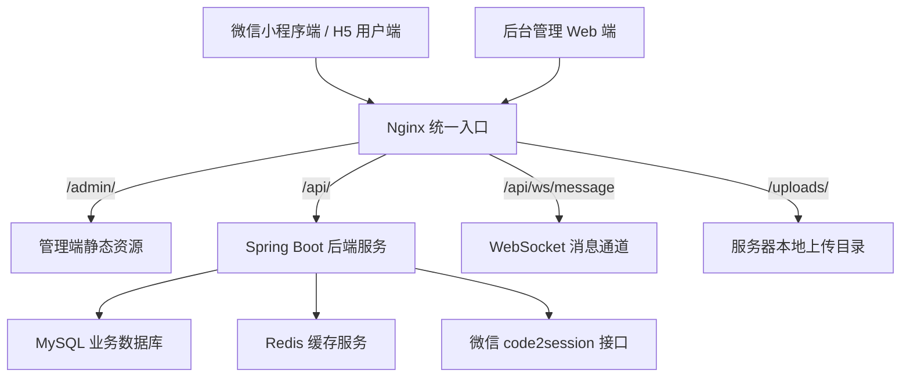
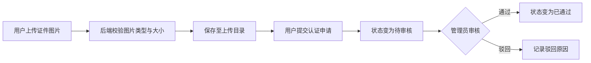
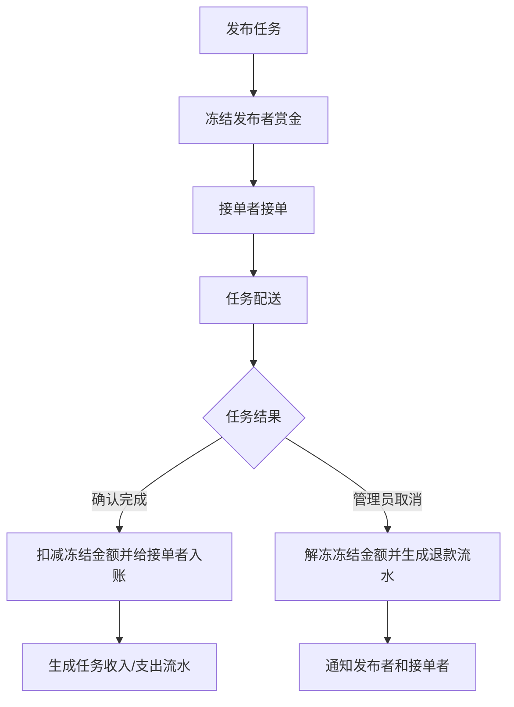
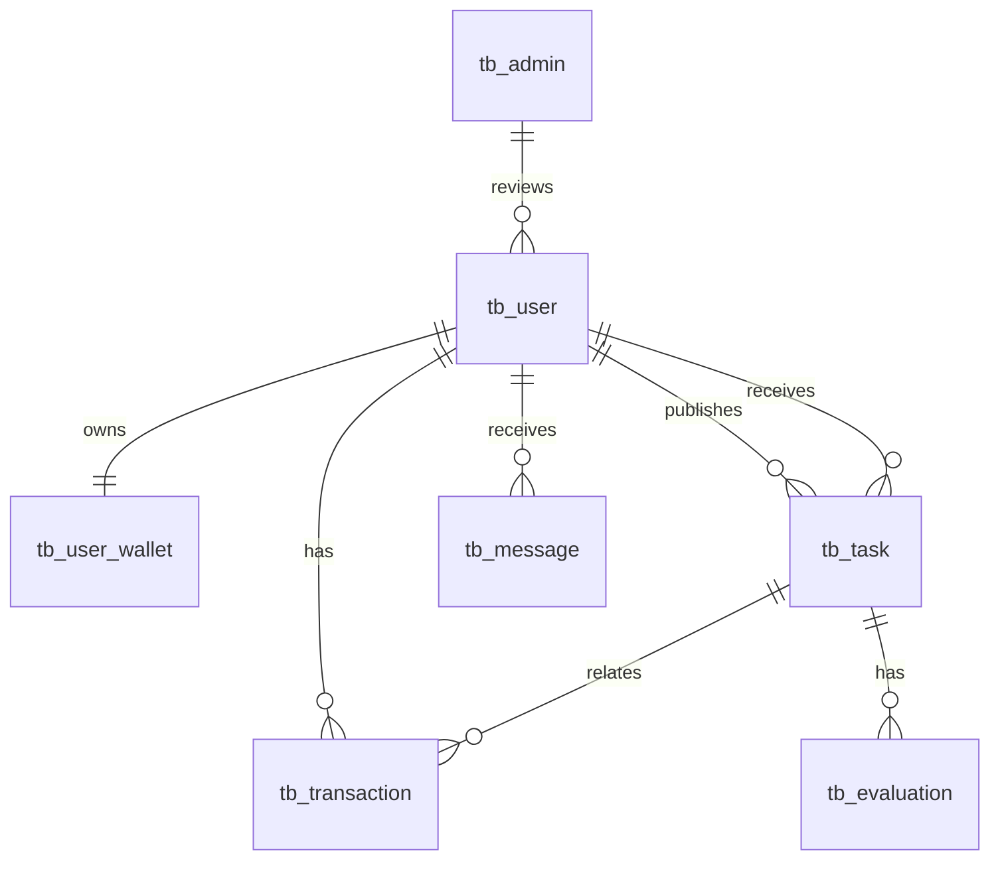

# 基于 Java 的校园跑腿接单与配送系统设计与实现

## 摘要

随着高校数字化服务场景不断丰富，校园内取送快递、代买物品、资料递送等即时性需求逐渐增多。传统线下委托方式存在信息分散、服务过程不可追踪、资金结算缺少约束等问题，难以满足校园用户对便捷性、安全性和效率的要求。针对上述问题，本文设计并实现了一套基于 Java 技术栈的校园跑腿接单与配送系统。系统面向学生用户提供微信小程序端，支持用户登录、实名认证、钱包管理、任务发布、任务接单、订单跟踪、评价反馈和消息通知等功能；同时提供后台管理端，用于用户管理、任务管理、钱包审核、实名认证审核、系统配置和运营数据查看。

系统采用前后端分离架构。后端基于 Spring Boot、MyBatis-Plus、MySQL、Redis、JWT 和 WebSocket 实现业务接口、身份认证、数据持久化和实时消息能力；用户端采用 Uniapp 开发，可构建为微信小程序和 H5；管理端采用 Vue 3 与 Ant Design Vue 构建。为满足上线运行要求，系统增加了生产环境配置、真实微信登录、管理员数据库账号、文件上传、增量数据库迁移、Nginx 同域名路径部署和 Docker Compose 部署方案。测试结果表明，系统主要功能流程完整，能够满足小规模校园场景下跑腿服务的信息发布、接单配送、钱包结算和后台审核需求。

**关键词**：校园跑腿；Spring Boot；微信小程序；MyBatis-Plus；JWT；前后端分离

## Abstract

With the continuous development of digital campus services, instant demands such as parcel pickup, item purchasing, document delivery and temporary errands have become increasingly common among college students. Traditional offline entrusting methods usually depend on acquaintances or chat groups, which leads to scattered information, poor task traceability, unclear fee settlement and difficulty in dispute handling. To solve these problems, this paper designs and implements a campus errand order receiving and delivery system based on the Java technology stack. The system provides a WeChat Mini Program for student users, supporting WeChat login, real-name verification, wallet management, task publishing, order receiving, task tracking, evaluation and message notification. Meanwhile, a web-based administration platform is provided for user management, task management, wallet review, real-name verification review, system configuration and operation data analysis.

The system adopts a front-end and back-end separated architecture. The back-end is implemented with Spring Boot, MyBatis-Plus, MySQL, Redis, JWT and WebSocket, providing business APIs, authentication, data persistence and real-time communication capabilities. The user side is developed with Uniapp and can be built as a WeChat Mini Program or H5 application, while the administration side is developed with Vue 3 and Ant Design Vue. In order to meet production deployment requirements, the system introduces production profiles, real WeChat code2session login, database-based administrator accounts, file upload management, incremental database migration, Nginx same-domain path deployment and Docker Compose orchestration. Test results show that the main business processes are complete and the system can satisfy the requirements of information publishing, order receiving, wallet settlement and background review in a small-scale campus errand service scenario.

**Key words**: Campus errand; Spring Boot; WeChat Mini Program; MyBatis-Plus; JWT; Front-end and back-end separation

## 1 绪论

### 1.1 研究背景

高校校园具有用户群体集中、空间范围相对固定、即时服务需求频繁等特点。学生在日常学习生活中经常遇到取快递、代买餐食、打印资料、临时递送物品等需求。传统处理方式通常依赖同学熟人帮忙或在社群中发布求助信息，这类方式虽然简单，但存在服务信息难以沉淀、任务状态不可追踪、服务费用不透明、交易纠纷难处理等问题。

移动互联网和小程序生态的发展为校园生活服务平台提供了较好的技术基础。微信小程序无需安装、入口轻量，适合校园用户快速发布和响应跑腿需求。后端服务通过统一 API 管理用户、任务、钱包和消息数据，可以使服务流程更加规范。本文以校园跑腿业务为对象，设计并实现一套能够支持小规模上线运行的接单与配送系统，探索校园内轻量化服务平台的设计方法。

### 1.2 研究意义

本系统的研究与实现具有以下意义：

第一，提高校园跑腿服务的信息化水平。系统将分散在社群中的临时需求统一纳入平台管理，使任务发布、接单、配送和完成确认形成闭环。

第二，提升交易过程的安全性。系统通过实名认证、钱包冻结、交易流水、后台审核等机制降低恶意接单、虚假发布和资金纠纷风险。

第三，提升后台运营管理能力。管理员可以在管理端审核实名认证、处理提现、管理任务和查看平台数据，从而提高平台运营效率。

第四，提供一个较完整的 Java Web 项目实践案例。系统覆盖用户端、管理端、后端接口、数据库、文件上传、WebSocket、Docker 部署等内容，具有较好的工程实践价值。

### 1.3 国内外研究现状

当前即时配送和本地生活服务平台发展较成熟，典型平台通过订单调度、支付结算、评价体系和风控机制支撑复杂业务。但大型平台通常面向城市级服务场景，系统复杂度和运营成本较高，不完全适用于高校内部的小范围服务需求。

校园场景中的服务平台通常具有轻量化、低成本、快速响应等特点。一些高校采用社群、表单或简单小程序实现需求撮合，但在身份可信、账务闭环、后台审核和部署运维方面仍不够完善。因此，设计一套适合校园小规模部署、功能闭环完整、后续可扩展的跑腿系统具有实际意义。

### 1.4 论文组织结构

本文共分为七章。第一章介绍研究背景、意义和论文结构；第二章分析系统需求；第三章介绍系统总体设计；第四章说明数据库设计；第五章阐述系统关键模块实现；第六章介绍系统测试与部署；第七章总结系统实现成果并展望后续改进方向。

## 2 系统需求分析

### 2.1 可行性分析

#### 2.1.1 技术可行性

系统采用成熟的 Java Web 技术栈。Spring Boot 能够快速构建 RESTful API 服务，MyBatis-Plus 简化了数据库访问，MySQL 适合保存结构化业务数据，Redis 可用于缓存与会话扩展，JWT 可实现无状态身份认证，WebSocket 可支持消息实时推送。用户端采用 Uniapp，可以兼顾微信小程序与 H5 构建；管理端采用 Vue 3，具备良好的组件化开发能力。因此系统在技术实现上具有可行性。

#### 2.1.2 经济可行性

系统面向单校或小规模校园场景，部署方案以单台云服务器为目标，使用 MySQL、Redis、Nginx 和 Docker Compose 即可运行，不依赖昂贵的商业中间件。文件上传采用服务器本地目录存储，降低了初期部署成本。后续如业务增长，可迁移至对象存储和多节点服务。

#### 2.1.3 操作可行性

用户端基于微信小程序，用户无需安装独立 App。发布任务、接单、钱包和实名认证等操作均通过移动端完成。管理员通过 Web 管理端进行审核和运营管理，交互方式符合常见后台系统使用习惯，具备较好的操作可行性。

### 2.2 功能需求

系统的参与角色主要包括普通用户、接单用户和平台管理员。普通用户可以发布任务、查看任务状态并完成付款确认；接单用户可以浏览可接任务、接单并完成配送；平台管理员负责用户审核、任务监管、钱包提现处理和系统基础配置。由于同一学生既可能发布任务，也可能承接任务，因此用户端不对普通用户和接单用户设置严格的账号隔离，而是通过任务状态、实名状态和钱包状态约束具体操作。

#### 2.2.1 用户端需求

用户端主要面向校园学生用户，核心功能包括：

1. 微信登录：用户通过微信小程序授权登录，后端通过微信接口换取 openid，建立平台用户身份。
2. 个人信息管理：用户可维护头像、昵称、联系方式等基本信息。
3. 实名认证：用户上传身份证或学生相关证明图片，提交后由管理员人工审核。
4. 钱包管理：用户可查看余额、冻结金额、可用余额和交易流水，可发起充值和提现申请。
5. 任务发布：用户填写任务类型、任务描述、取送地址、赏金和联系方式后发布跑腿任务。
6. 任务浏览与接单：跑腿用户可浏览待接任务并进行接单。
7. 任务状态跟踪：系统记录任务从发布、接单、配送到完成的状态变化。
8. 评价反馈：任务完成后用户可对服务进行评价。
9. 消息通知：系统向相关用户推送任务状态、退款、结算等通知。

#### 2.2.2 管理端需求

管理端主要面向平台管理员，核心功能包括：

1. 管理员登录：管理员账号从数据库读取，密码使用 BCrypt 加密存储。
2. 用户管理：查看用户列表、用户状态和用户详情。
3. 实名审核：查看待审核用户资料，对认证申请进行通过或驳回。
4. 任务管理：查看任务列表和详情，对异常任务进行取消处理。
5. 钱包管理：查看交易流水，处理用户提现申请。
6. 配置管理：维护系统基础配置、任务配置、钱包配置和协议配置。
7. 数据看板：展示用户、任务、交易等运营统计数据。

#### 2.2.3 功能需求汇总

为了更清晰地描述系统功能边界，本文将主要功能需求整理如表 2-1 所示。

表 2-1 系统主要功能需求表

| 功能编号 | 功能名称 | 使用角色 | 功能说明 | 优先级 |
| --- | --- | --- | --- | --- |
| F01 | 微信登录 | 用户 | 通过微信临时 code 换取 openid，创建或识别平台用户 | 高 |
| F02 | 个人资料维护 | 用户 | 修改昵称、头像、联系方式等基础资料 | 中 |
| F03 | 实名认证提交 | 用户 | 上传证件图片并提交认证申请 | 高 |
| F04 | 任务发布 | 用户 | 填写跑腿任务信息并冻结任务赏金 | 高 |
| F05 | 任务接单 | 用户 | 浏览待接单任务并承接配送任务 | 高 |
| F06 | 任务完成确认 | 用户 | 发布者确认任务完成，触发钱包结算 | 高 |
| F07 | 钱包查询 | 用户 | 查询余额、冻结金额、可用余额和交易流水 | 高 |
| F08 | 充值与提现 | 用户、管理员 | 用户发起充值或提现，管理员处理提现申请 | 高 |
| F09 | 实名审核 | 管理员 | 审核用户实名认证申请，通过或驳回 | 高 |
| F10 | 任务监管 | 管理员 | 查看任务信息，对异常任务进行取消处理 | 高 |
| F11 | 消息通知 | 用户 | 接收任务状态、退款和结算相关通知 | 中 |
| F12 | 系统配置 | 管理员 | 维护系统名称、任务规则、钱包规则和协议内容 | 中 |

### 2.3 业务规则分析

校园跑腿系统不仅需要完成任务信息撮合，还需要保证任务状态和资金状态的一致性。因此，系统在业务规则上做了以下约束。

第一，用户发布任务前需要具备有效登录状态，任务赏金必须大于零，且用户钱包可用余额需要满足冻结要求。任务发布成功后，系统冻结对应金额，避免发布者在任务完成前将资金全部提现或用于其他任务。

第二，任务接单需要满足任务处于待接单状态，且接单者不能接取自己发布的任务。接单成功后，系统记录接单者编号，并更新任务状态。

第三，任务完成结算需要由发布者或符合业务权限的操作触发。结算时系统需要检查任务是否已完成、是否已生成收入流水，避免重复结算。

第四，管理员取消任务时，需要同时处理任务状态、冻结金额、交易流水和消息通知。对于已冻结但未结算的任务，取消后应释放发布者冻结金额，并生成退款说明。

第五，提现不是实时自动打款。用户发起提现后，系统生成待处理提现流水。管理员确认线下或平台侧处理完成后，再将提现流水标记为成功；若驳回，则将金额退回用户钱包。

第六，实名认证采用人工审核。用户提交后状态为待审核，管理员通过后状态为已通过，驳回后状态为已驳回并记录原因。该状态会影响平台后续对用户可信度的判断。

### 2.4 非功能需求

#### 2.4.1 安全性需求

系统需要保证接口访问安全和敏感配置安全。后端使用 JWT 进行身份认证，管理员接口区分管理员角色。数据库密码、JWT 密钥、微信 appid 和 secret 等敏感信息通过环境变量配置，不写入代码仓库。生产环境关闭演示登录后门，限制 CORS 来源，并将接口文档仅开放在开发环境。

#### 2.4.2 可靠性需求

跑腿任务涉及余额冻结、扣款、退款和收入结算，因此系统需要保证账务操作一致性。钱包更新采用条件更新或乐观锁字段，避免并发情况下余额错误。任务完成结算和任务取消退款需要具备幂等保护，避免重复生成流水。

#### 2.4.3 可维护性需求

系统采用分层结构，包括 controller、service、mapper、entity、config 等模块。业务逻辑集中在 service 层，数据访问通过 mapper 层完成。前后端通过统一 API 通信，便于后续扩展新功能。

#### 2.4.4 可部署性需求

系统需要支持单台云服务器上线。部署时管理端通过 `/admin/` 路径访问，后端 API 通过 `/api/` 路径访问，上传文件通过 `/uploads/` 路径暴露，WebSocket 使用 `/api/ws/message` 连接。系统提供 Dockerfile、Nginx 配置、生产环境变量样例和 Docker Compose 配置，方便上线部署。

#### 2.4.5 易用性需求

用户端界面应尽量减少操作步骤，使用户能够快速完成任务发布、接单和钱包查看。管理端应采用清晰的列表、筛选、详情和审核操作，使管理员能够快速定位待处理事项。错误提示需要使用用户能够理解的语言，例如余额不足、认证待审核、文件类型不支持等。

#### 2.4.6 可扩展性需求

系统初期部署在单台服务器上，但架构设计应保留扩展空间。文件存储后续可由本地目录迁移至对象存储；钱包模块后续可接入微信支付；消息模块可扩展为订阅消息、短信或邮件；后端服务也可在访问量增长后拆分为多节点部署。

## 3 系统总体设计

### 3.1 系统架构设计

系统采用前后端分离架构，整体分为用户端、管理端、后端服务层和数据存储层。

用户端使用 Uniapp 开发，主要运行在微信小程序中，负责用户登录、任务发布、接单、钱包和消息交互。管理端使用 Vue 3 开发，部署在 Nginx 中，以 `/admin/` 路径访问。后端服务使用 Spring Boot 开发，对外提供 RESTful API 和 WebSocket 接口。数据层包括 MySQL 和 Redis，其中 MySQL 保存业务数据，Redis 用于缓存和后续扩展。

生产部署时，Nginx 作为统一入口：`/admin/` 指向管理端静态资源，`/api/` 反向代理后端服务，`/uploads/` 暴露本地上传文件目录，WebSocket 请求通过 Nginx 完成协议升级。

图 3-1 系统总体架构图



该架构的优势在于职责边界清晰。Nginx 负责统一入口、静态资源托管、反向代理和 WebSocket 升级；后端服务专注于业务处理；数据库负责持久化；前端应用只通过标准 API 与后端通信。由于管理端、用户端和后端服务可以独立构建，因此系统后续维护和升级更加灵活。

### 3.2 后端分层设计

后端采用典型分层结构：

1. 控制器层：负责接收 HTTP 请求、参数校验和返回统一响应。
2. 业务服务层：负责用户、任务、钱包、交易、消息、实名认证等核心业务逻辑。
3. 数据访问层：通过 MyBatis-Plus Mapper 与数据库交互。
4. 实体与 DTO 层：实体类映射数据库表，DTO 用于接收前端请求参数。
5. 配置层：负责跨域、拦截器、WebSocket、上传、安全组件和启动初始化。

该结构使接口处理、业务规则和数据访问相互分离，便于维护和测试。

表 3-1 后端主要包结构说明

| 包或模块 | 主要职责 |
| --- | --- |
| controller | 定义用户端和管理端接口，完成参数接收与响应封装 |
| service | 实现核心业务规则，如任务结算、提现审核、实名认证审核 |
| mapper | 定义数据库访问方法，完成实体与数据表之间的映射 |
| entity | 定义用户、任务、钱包、交易、消息等数据库实体 |
| dto | 定义请求参数对象，降低接口入参与数据库实体之间的耦合 |
| config | 定义跨域、拦截器、WebSocket、安全组件和启动初始化逻辑 |
| util | 定义 JWT、密码、日期等通用工具 |

### 3.3 前端设计

用户端围绕校园跑腿主流程设计，包括首页任务浏览、发布任务、任务详情、钱包、实名认证、消息和个人中心等页面。小程序通过封装的 request 工具统一处理 API 请求、Token 携带、错误提示和登录失效跳转。

管理端采用侧边栏导航和内容区域布局，包含仪表盘、用户管理、任务管理、钱包管理、实名认证审核、评价管理、轮播图和系统设置等模块。管理端请求统一通过 Axios 封装，API 基础路径由环境变量控制，生产构建路径固定为 `/admin/`。

### 3.4 核心业务流程设计

#### 3.4.1 登录流程

用户在小程序端发起微信登录，前端获取临时 code 后提交给后端。后端调用微信 `code2session` 接口，使用配置中的 appid 和 secret 换取 openid、unionid 和 session_key。若用户不存在，则创建新用户和钱包；若用户已存在，则更新登录信息。登录成功后后端签发 JWT，前端保存 Token 并在后续请求中携带。

#### 3.4.2 实名认证流程

用户上传身份证正反面或相关证明图片，文件保存至服务器上传目录，并按用户目录隔离。用户提交实名信息后，认证状态变为待审核。管理员在管理端查看审核列表，可以通过或驳回申请。通过后用户认证状态变为已通过，驳回时系统记录驳回原因，用户端可查询最新状态。

图 3-2 实名认证流程图



#### 3.4.3 任务与账务流程

用户发布任务时，系统根据任务赏金冻结发布者钱包余额。任务被接单后进入配送流程。任务完成确认后，系统从发布者冻结金额中扣款，并向接单者钱包入账，同时生成交易流水。若管理员取消任务，系统解冻发布者冻结金额，标记原支付流水失败，生成退款流水，并通知相关用户。

图 3-3 任务账务闭环流程图



#### 3.4.4 提现流程

用户发起提现后，系统先扣减用户余额并生成待处理提现流水。管理员在后台审核提现申请。审核通过后，流水状态变为成功；审核驳回时，系统将金额退回用户钱包，并生成对应退款记录。由于本系统当前不接入微信支付，提现属于平台人工处理流程。

### 3.5 接口设计

系统接口采用 RESTful 风格，统一以前缀 `/api` 对外提供服务。用户端接口主要包括认证、用户、任务、钱包、消息和评价模块；管理端接口统一放在 `/admin` 路径下，并通过拦截器校验管理员角色。

表 3-2 主要接口设计表

| 接口路径 | 请求方法 | 功能说明 | 权限 |
| --- | --- | --- | --- |
| `/auth/wx-login` | POST | 微信登录并签发 Token | 公开 |
| `/user/avatar` | POST | 上传用户头像 | 用户 |
| `/user/upload-idcard` | POST | 上传身份证图片 | 用户 |
| `/user/verify-status` | GET | 查询实名认证状态 | 用户 |
| `/user/verify` | POST | 提交实名认证申请 | 用户 |
| `/wallet/info` | GET | 查询钱包余额、冻结金额和可用余额 | 用户 |
| `/task` | POST | 发布任务 | 用户 |
| `/task/{id}/receive` | POST | 接取任务 | 用户 |
| `/admin/login` | POST | 管理员登录 | 公开 |
| `/admin/change-password` | POST | 管理员修改密码 | 管理员 |
| `/admin/user/verify/list` | GET | 查询实名认证审核列表 | 管理员 |
| `/admin/user/verify/{id}/approve` | POST | 通过实名认证申请 | 管理员 |
| `/admin/user/verify/{id}/reject` | POST | 驳回实名认证申请 | 管理员 |
| `/admin/wallet/withdraw/{id}/approve` | POST | 通过提现申请 | 管理员 |
| `/admin/wallet/withdraw/{id}/reject` | POST | 驳回提现申请 | 管理员 |

### 3.6 安全设计

系统安全设计主要体现在身份认证、权限隔离、密码存储、敏感配置和上传校验五个方面。

第一，系统使用 JWT 作为接口认证凭证。用户登录和管理员登录成功后分别签发带有角色信息的 Token。后端拦截器解析 Token 后，将用户编号和 openid 保存到上下文中，供后续业务方法使用。

第二，用户接口和管理员接口进行权限隔离。普通用户 Token 不能访问 `/admin/` 下的管理接口，管理员接口要求 Token 中角色为管理员。

第三，管理员密码使用 BCrypt 哈希算法存储，不保存明文密码。BCrypt 具有随机盐和可调计算成本，能够降低数据库泄露后的密码撞库风险。

第四，生产环境下数据库密码、Redis 密码、JWT 密钥、微信 appid、微信 secret 和管理员初始密码均通过环境变量注入，不直接写入代码仓库。

第五，文件上传接口限制文件大小和图片类型。系统只允许上传常见图片格式，并将证件图片按用户目录隔离保存，降低非法文件上传风险。

## 4 数据库设计

### 4.1 数据库设计原则

数据库采用 MySQL 8.0，字符集使用 utf8mb4，以保证中文和特殊字符的存储兼容性。各业务表采用逻辑删除字段，基础实体包含创建时间、更新时间等审计字段。涉及账务的表保存余额、冻结金额、交易类型、交易状态和关联任务编号，以便追踪资金流向。

### 4.2 核心数据表

#### 4.2.1 用户表 tb_user

用户表用于保存平台用户基本信息，包括微信 openid、unionid、昵称、头像、手机号、性别、认证状态、认证图片、认证审核人和审核时间等字段。用户表是任务、钱包、消息和评价等业务表的基础关联表。

表 4-1 用户表主要字段

| 字段名 | 类型 | 说明 |
| --- | --- | --- |
| id | bigint | 用户主键 |
| openid | varchar | 微信小程序用户唯一标识 |
| unionid | varchar | 微信开放平台统一标识，可为空 |
| nickname | varchar | 用户昵称 |
| avatar | varchar | 用户头像地址 |
| phone | varchar | 用户手机号 |
| status | tinyint | 用户状态 |
| is_verified | tinyint | 是否已认证 |
| verify_status | tinyint | 认证状态，0 未提交、1 待审核、2 已通过、3 已驳回 |
| verify_reject_reason | varchar | 实名认证驳回原因 |
| id_card_front_image | varchar | 证件正面图片地址 |
| id_card_back_image | varchar | 证件反面图片地址 |
| verify_time | datetime | 审核时间 |
| verify_admin_id | bigint | 审核管理员编号 |

#### 4.2.2 用户钱包表 tb_user_wallet

钱包表用于保存用户余额、冻结金额、累计收入、累计支出和版本号。余额表示用户账户总余额，冻结金额表示已被任务占用但尚未结算的资金，可用余额由 `balance - frozen_amount` 计算。版本号用于支持并发场景下的条件更新。

表 4-2 用户钱包表主要字段

| 字段名 | 类型 | 说明 |
| --- | --- | --- |
| id | bigint | 钱包主键 |
| user_id | bigint | 用户编号 |
| balance | decimal | 用户总余额 |
| frozen_amount | decimal | 已冻结金额 |
| total_income | decimal | 累计收入 |
| total_expense | decimal | 累计支出 |
| version | int | 乐观锁版本号 |

钱包表中不直接存储可用余额，而是在查询接口中通过余额减冻结金额计算得到。这样可以减少冗余字段带来的数据不一致风险。

#### 4.2.3 交易流水表 tb_transaction

交易流水表用于记录充值、提现、任务支付、任务收入、退款等交易行为。每条流水包含用户编号、交易类型、金额、状态、关联任务编号和备注信息。通过交易流水可以追踪钱包变动原因，是账务审计的重要依据。

表 4-3 交易流水表主要字段

| 字段名 | 类型 | 说明 |
| --- | --- | --- |
| id | bigint | 流水主键 |
| user_id | bigint | 用户编号 |
| type | tinyint | 交易类型，如充值、提现、任务支付、收入、退款 |
| amount | decimal | 交易金额 |
| status | tinyint | 交易状态，如待处理、成功、失败 |
| related_task_id | bigint | 关联任务编号 |
| remark | varchar | 流水备注 |

#### 4.2.4 任务表 tb_task

任务表用于保存跑腿任务信息，包括发布者、接单者、任务类型、标题、描述、取件地址、送达地址、联系方式、赏金、状态和完成时间等。任务状态用于控制发布、接单、配送、完成和取消等流程。

表 4-4 任务表主要字段

| 字段名 | 类型 | 说明 |
| --- | --- | --- |
| id | bigint | 任务主键 |
| publisher_id | bigint | 发布者编号 |
| runner_id | bigint | 接单者编号 |
| title | varchar | 任务标题 |
| description | text | 任务描述 |
| category | varchar | 任务分类 |
| pickup_address | varchar | 取件地址 |
| delivery_address | varchar | 送达地址 |
| reward | decimal | 任务赏金 |
| status | tinyint | 任务状态 |
| complete_time | datetime | 完成时间 |

#### 4.2.5 评价表 tb_evaluation

评价表用于记录任务完成后的用户评价，包括任务编号、评价人、被评价人、评分和评价内容。评价数据可以用于用户信用体系和服务质量分析。

#### 4.2.6 消息表 tb_message

消息表用于保存系统通知和业务消息，包括接收用户、标题、内容、消息类型、关联业务编号、阅读状态等字段。系统在任务接单、取消、退款和结算等场景中生成消息。

#### 4.2.7 管理员表 tb_admin

管理员表用于保存后台管理员账号，包括用户名、密码哈希、昵称、角色、状态、是否强制修改密码和最后登录时间。密码采用 BCrypt 算法存储，避免明文密码带来的安全风险。

表 4-5 管理员表主要字段

| 字段名 | 类型 | 说明 |
| --- | --- | --- |
| id | bigint | 管理员主键 |
| username | varchar | 管理员登录名 |
| password_hash | varchar | BCrypt 密码哈希 |
| nickname | varchar | 管理员昵称 |
| role | varchar | 管理员角色 |
| status | tinyint | 账号状态 |
| force_password_change | tinyint | 是否要求修改初始密码 |
| last_login_time | datetime | 最后登录时间 |

### 4.3 数据表关系

用户与钱包是一对一关系，每个用户创建时对应一个钱包账户。用户与任务存在一对多关系，一个用户可以发布多个任务，也可以接取多个任务。任务与交易流水存在一对多关系，一个任务可能对应冻结、支付、收入或退款等多条流水。任务与评价通常是一对一或一对多关系，视业务规则而定。用户与消息是一对多关系，一个用户可以接收多条系统消息。管理员与实名认证审核记录通过审核人字段建立关联。

图 4-1 核心实体关系图



### 4.4 数据一致性设计

在本系统中，数据一致性主要集中在任务状态与钱包金额之间。若只更新任务状态而未同步处理钱包流水，容易造成余额异常；若只处理钱包而未更新任务状态，也会造成业务状态不可信。因此系统将任务结算、任务取消、提现审核等操作放在事务中执行。

以任务完成结算为例，系统需要先检查任务状态和交易流水是否已经存在，再执行扣款和入账。若任一关键步骤失败，则应回滚事务，避免出现发布者扣款成功但接单者未入账的情况。提现驳回同样需要在同一事务中完成用户余额退回、原提现流水失败和退款流水生成。

## 5 系统详细设计与实现

### 5.1 微信登录模块实现

微信登录模块是用户身份体系的入口。小程序端调用微信接口获取临时 code，并将 code 提交到后端 `/auth/wx-login` 接口。后端通过 WeChatAuthService 访问微信 `code2session` 接口，校验微信返回结果。如果微信返回错误码，系统返回明确业务错误；如果缺少 appid 或 secret 配置，系统拒绝真实登录请求。

登录成功后，系统根据 openid 查询用户。如果用户不存在，则创建用户基础信息，并初始化钱包。随后系统生成 JWT 返回给前端。JWT 中包含用户编号、openid、角色、签发时间、过期时间和签发者信息。后续请求通过请求头中的 Bearer Token 完成身份识别。

微信登录模块的关键在于区分开发环境与生产环境。开发环境可以通过显式环境变量开启模拟登录，以便本地调试；生产环境固定关闭模拟能力，必须配置真实微信 appid 和 secret。这样既保证开发效率，又避免演示后门进入线上系统。

登录流程的伪代码如下：

```text
接收小程序 code
如果生产环境缺少微信 appid 或 secret，则返回配置错误
调用微信 code2session 接口
如果微信返回 errcode，则返回登录失败原因
根据 openid 查询用户
如果用户不存在，则创建用户并初始化钱包
生成包含 userId、openid、role 的 JWT
返回 Token 和用户基本信息
```

### 5.2 管理员账号模块实现

原有演示账号不适合生产环境，因此系统新增管理员账号表。管理员登录时，后端根据用户名查询账号，检查账号状态，并使用 BCrypt 校验密码。登录成功后生成管理员角色 JWT。系统启动时可根据环境变量创建初始管理员账号，便于首次部署。

管理员可通过修改密码接口更新密码。新密码写入数据库前使用 BCrypt 加密，并清除强制修改密码标识。该设计避免了代码中硬编码默认账号和默认密码，提高了后台安全性。

管理员模块在设计上遵循最小暴露原则。除登录接口外，其他管理端接口均需要管理员 Token。系统还在登录响应中返回是否需要修改初始密码的标识，便于前端提示管理员及时更换部署时生成的初始密码。

### 5.3 实名认证模块实现

实名认证模块包括用户端提交和管理端审核两部分。用户端先上传证件图片，后端通过 FileStorageService 校验文件类型和大小，仅允许 jpg、jpeg、png、webp 等图片格式。文件保存至服务器本地上传目录，并按用户编号进行目录隔离。系统返回 `/uploads/...` 形式的访问路径，由 Nginx 暴露静态文件。

用户提交实名申请后，系统记录真实姓名、证件图片路径和提交时间，并将审核状态设置为待审核。管理员在管理端查看待审核列表，可以对申请进行通过或驳回。通过后用户认证状态变为已通过；驳回后系统记录驳回原因，用户可在小程序端查看并重新提交。

### 5.4 钱包与交易模块实现

钱包模块是系统资金闭环的核心。系统采用虚拟余额模式，不直接接入微信支付。用户充值和提现通过平台内部接口记录，提现由管理员人工确认。

为了避免并发场景下余额错误，钱包冻结、解冻、扣款和入账操作统一在服务层处理，并通过条件更新限制余额和冻结金额。发布任务时，系统先判断用户可用余额是否充足，再冻结任务赏金。任务完成时，系统进行幂等检查，避免同一任务重复结算。结算成功后，系统扣减发布者冻结金额，并向接单者增加收入。

提现流程中，用户提交提现申请后生成待处理流水。管理员审核通过则标记流水成功；审核驳回则将金额退回用户钱包，并生成退款流水。该设计清晰区分“申请中”和“已完成”状态，避免用户误以为点击提现后已完成真实打款。

钱包冻结与结算的核心逻辑如表 5-1 所示。

表 5-1 钱包核心操作说明

| 操作 | 触发场景 | 金额变化 | 交易流水 |
| --- | --- | --- | --- |
| 冻结余额 | 发布任务 | frozen_amount 增加 | 生成任务支付相关记录 |
| 解冻余额 | 任务取消 | frozen_amount 减少 | 生成退款流水 |
| 扣减冻结金额 | 任务完成 | balance 和 frozen_amount 同时减少 | 标记任务支付完成 |
| 接单者入账 | 任务完成 | runner balance 增加 | 生成任务收入流水 |
| 提现申请 | 用户提现 | balance 减少 | 生成待处理提现流水 |
| 提现驳回 | 管理员驳回 | balance 增加 | 生成提现驳回退款流水 |

任务完成结算的伪代码如下：

```text
查询任务信息
如果任务不存在或接单者为空，则返回失败
如果任务已存在收入流水，则直接返回，避免重复结算
解冻并扣减发布者冻结金额
给接单者钱包增加收入
生成发布者支出流水和接单者收入流水
更新任务状态为已完成
发送结算通知
```

### 5.5 任务模块实现

任务模块围绕跑腿任务生命周期设计。用户发布任务后，任务进入待接单状态，并冻结发布者赏金。跑腿用户接单后，任务进入配送状态。配送完成并由发布者确认后，系统触发结算。管理员可对异常任务进行取消，系统同步解冻资金、生成退款流水并发送通知。

系统在任务完成结算时加入幂等保护，如果任务已完成或已存在对应收入流水，则不会重复结算。该机制可以降低用户重复点击、网络重试或接口重复调用造成的账务风险。

任务状态设计是任务模块的核心。状态字段不仅用于前端展示，也用于后端判断当前操作是否合法。例如待接单任务允许接单，配送中任务允许完成，已完成任务不能再次结算，已取消任务不能继续接单。通过状态机约束，可以避免任务流程混乱。

表 5-2 任务状态流转说明

| 当前状态 | 可执行操作 | 下一个状态 | 说明 |
| --- | --- | --- | --- |
| 待接单 | 接单 | 已接单或配送中 | 记录接单者 |
| 待接单 | 管理员取消 | 已取消 | 解冻发布者赏金 |
| 已接单/配送中 | 确认完成 | 已完成 | 触发钱包结算 |
| 已接单/配送中 | 管理员取消 | 已取消 | 根据业务规则退款或通知 |
| 已完成 | 无重复结算 | 已完成 | 幂等返回 |
| 已取消 | 无后续业务 | 已取消 | 终态 |

### 5.6 消息模块实现

消息模块用于向用户反馈业务状态变化。系统在任务接单、任务取消、退款、结算等场景中生成消息记录。后端提供 WebSocket 连接能力，前端可通过 WebSocket 接收实时消息。生产部署时 WebSocket 地址通过环境变量配置，并由 Nginx 对 `/api/ws/message` 路径进行协议升级代理。

### 5.7 文件上传与静态资源访问

系统上传文件保存到服务器本地目录，上传目录通过环境变量配置。文件保存时按类别和用户编号划分路径，避免不同用户文件混杂。Nginx 将 `/uploads/` 映射到上传目录，实现证件图和头像的静态访问。考虑到证件图片具有敏感性，后续可进一步增加访问鉴权、图片水印或迁移至对象存储私有桶。

### 5.8 生产部署实现

系统支持单机生产部署。后端构建为 Java 应用镜像，管理端构建为静态资源并由 Nginx 托管。Docker Compose 编排 MySQL、Redis、后端 API 和 Nginx。Nginx 统一对外暴露 HTTP/HTTPS 入口，并按路径转发请求。

生产环境中所有敏感信息通过 `.env` 文件或服务器环境变量传入，包括数据库密码、Redis 密码、JWT 密钥、微信 appid、微信 secret、管理员初始密码和上传目录。数据库升级采用增量 SQL，不清空现有业务数据。

生产部署路径设计如表 5-3 所示。

表 5-3 生产访问路径设计

| 路径 | 目标 | 说明 |
| --- | --- | --- |
| `/admin/` | 管理端静态资源 | 支持前端路由刷新 |
| `/api/` | Spring Boot 后端服务 | 统一业务接口入口 |
| `/api/ws/message` | WebSocket 服务 | 支持消息实时连接 |
| `/uploads/` | 上传文件目录 | 暴露头像和证件图访问路径 |

### 5.9 异常处理与统一响应

系统后端接口采用统一响应结构，通常包含业务状态码、提示信息和数据内容。统一响应有利于前端集中处理成功、失败、未登录、权限不足和服务器异常等情况。对于业务异常，系统返回明确的错误提示；对于未捕获异常，系统通过全局异常处理器记录日志并返回系统错误，避免将内部异常堆栈暴露给前端。

统一异常处理的意义在于提高系统稳定性和用户体验。用户端在余额不足、认证未通过、文件类型错误等场景下可以得到明确提示；管理端在审核失败或网络异常时也可以给出可理解的反馈。

### 5.10 前端交互实现

用户端通过封装请求工具统一附加 Token，并在登录失效时清理会话和跳转登录页。钱包页面展示余额、冻结金额、可用余额和流水信息，充值与提现按钮跳转到对应页面。实名认证页面根据后端状态展示未提交、待审核、已通过或已驳回状态，保证用户看到的状态与后端一致。

管理端采用列表、筛选、操作按钮和弹窗预览等常见后台交互方式。实名认证审核页面支持按状态筛选、查看证件图片、通过和驳回操作。钱包页面支持处理待审核提现。登录页不再展示默认账号密码，符合生产系统的安全要求。

## 6 系统测试与部署

### 6.1 测试环境

系统开发与测试环境包括 JDK 17、Maven、MySQL 8.0、Redis、Node.js、pnpm 和 npm。后端通过 Maven 执行单元测试，管理端通过 pnpm 构建生产包，小程序端通过 Uniapp 构建 H5 或微信小程序产物。

表 6-1 测试环境说明

| 环境项 | 说明 |
| --- | --- |
| 操作系统 | Windows 开发环境，生产目标为 Linux 云服务器 |
| JDK | JDK 17 |
| 后端构建工具 | Maven |
| 数据库 | MySQL 8.0 |
| 缓存 | Redis |
| 管理端运行环境 | Node.js、pnpm |
| 小程序端构建工具 | Uniapp、npm |
| 部署组件 | Docker、Docker Compose、Nginx |

### 6.2 后端测试

后端测试覆盖了全局异常处理、任务服务、微信登录服务和文件上传服务等内容。微信登录测试验证了开发模拟模式、缺少微信配置等情况。文件上传测试验证了图片文件保存和非法文件类型拒绝。执行 `mvn test` 后测试通过，说明后端主要组件能够正常编译并满足当前单元测试预期。

表 6-2 后端测试用例示例

| 测试编号 | 测试模块 | 测试内容 | 预期结果 |
| --- | --- | --- | --- |
| T01 | 全局异常 | 模拟业务异常和系统异常 | 返回统一错误响应 |
| T02 | 微信登录 | 缺少微信配置时调用登录 | 返回配置错误 |
| T03 | 微信登录 | 微信返回错误码 | 返回明确登录失败原因 |
| T04 | 文件上传 | 上传合法图片 | 保存成功并返回访问路径 |
| T05 | 文件上传 | 上传非图片文件 | 拒绝上传 |
| T06 | 任务服务 | 任务重复结算 | 不重复生成收入流水 |
| T07 | 钱包服务 | 余额不足冻结 | 返回失败，不修改余额 |
| T08 | 管理员登录 | 错误密码登录 | 登录失败 |

### 6.3 前端构建测试

管理端执行 `pnpm run build`，构建结果通过，说明 Vue 3 管理端代码能够完成 TypeScript 检查和生产构建。小程序项目执行 `npm run build:h5`，构建结果通过，说明 Uniapp 用户端可以完成 H5 构建。后续上线前还需要执行微信小程序构建并在微信开发者工具中进行真机调试。

表 6-3 前端测试与构建结果

| 测试项 | 测试命令 | 测试结果 | 说明 |
| --- | --- | --- | --- |
| 管理端生产构建 | `pnpm run build` | 通过 | 验证 `/admin/` base 与 TypeScript 构建 |
| 用户端 H5 构建 | `npm run build:h5` | 通过 | 验证 Uniapp H5 构建能力 |
| 小程序生产构建 | `npm run build:mp-weixin` | 待验收 | 需结合微信开发者工具和真实 appid |
| 管理端路由刷新 | 部署后访问子路由 | 待验收 | 依赖 Nginx 生产环境 |

### 6.4 部署验收

部署验收包括以下内容：

1. 执行增量 SQL，确认 `tb_admin`、实名认证字段和钱包版本字段创建成功。
2. 配置生产 `.env`，填写数据库、Redis、JWT、微信和管理员初始化参数。
3. 执行 `docker compose -f docker-compose.prod.yml up -d` 启动服务。
4. 访问 `/admin/` 确认管理端可打开，刷新子路由不出现 404。
5. 访问 `/api/` 接口确认后端服务正常。
6. 连接 `/api/ws/message` 确认 WebSocket 可用。
7. 配置微信小程序合法域名，验证 HTTPS 下登录和接口请求正常。
8. 手工验证用户登录、实名认证、任务发布、接单、完成、钱包流水、提现审核和管理员取消任务流程。

### 6.5 主要业务链路手工测试

除自动化测试和构建测试外，系统上线前还需要进行完整业务链路手工测试。手工测试可以覆盖前后端交互、真实数据库状态变化、上传文件访问和 WebSocket 消息等自动化单元测试不容易覆盖的部分。

表 6-4 主业务链路手工测试表

| 测试链路 | 操作步骤 | 验证重点 |
| --- | --- | --- |
| 用户登录链路 | 小程序获取 code，调用微信登录接口 | Token 正常返回，用户和钱包自动创建 |
| 实名认证链路 | 上传证件图片，提交认证，管理员通过或驳回 | 文件可访问，状态正确变化，驳回原因可见 |
| 任务发布链路 | 用户充值或后台加余额，发布任务 | 钱包冻结金额增加，任务状态为待接单 |
| 接单配送链路 | 另一用户接单并完成配送 | 任务接单者正确，状态流转正确 |
| 完成结算链路 | 发布者确认完成 | 发布者扣款，接单者入账，流水完整 |
| 管理员取消链路 | 管理员取消异常任务 | 冻结金额释放，退款流水生成，消息通知出现 |
| 提现审核链路 | 用户发起提现，管理员通过或驳回 | 待处理、成功、驳回与余额变化一致 |

### 6.6 测试结果分析

从当前测试结果看，系统后端单元测试、管理端生产构建和用户端 H5 构建均已通过，说明系统具备基本运行和上线候选能力。需要注意的是，构建通过并不等同于真实生产验收完成。由于微信登录、HTTPS 证书、小程序合法域名、Nginx 代理和 Docker 网络均依赖实际服务器环境，因此上线前仍需在目标服务器进行一次完整部署演练。

在测试覆盖方面，当前测试更侧重服务层和构建验证。后续可继续补充接口集成测试和端到端测试，例如使用测试数据库验证任务发布到结算的完整链路，或使用浏览器自动化工具验证管理端审核流程。

## 7 总结与展望

### 7.1 总结

本文设计并实现了一套基于 Java 的校园跑腿接单与配送系统。系统采用 Spring Boot、MyBatis-Plus、MySQL、Redis、JWT、WebSocket、Uniapp 和 Vue 3 等技术，完成了用户端、管理端和后端服务的主要功能。系统支持微信登录、实名认证、任务发布、任务接单、钱包结算、交易流水、消息通知和后台审核等功能，能够满足校园小规模跑腿服务平台的基本运行需求。

在上线能力方面，系统增加了生产环境配置、真实微信登录、管理员数据库账号、文件上传、Nginx 同域名路径部署、Docker Compose 编排和增量数据库迁移脚本。相比演示型 MVP，系统在安全性、账务一致性、部署规范和后台运营能力方面都有明显提升。

通过本系统的设计与实现，可以看出校园跑腿业务虽然规模相对较小，但仍然包含身份认证、任务撮合、资金冻结、状态流转、后台审核和消息通知等典型互联网业务要素。若缺少统一平台管理，容易产生任务信息混乱、责任边界不清和账务纠纷等问题。本文实现的系统通过用户端与管理端配合，将任务流、资金流和审核流统一起来，形成了较完整的业务闭环。

### 7.2 不足之处

由于系统定位为小规模单机上线版本，仍存在一些不足。第一，文件上传目前使用服务器本地目录，扩展性和灾备能力有限。第二，提现采用人工处理，尚未接入真实支付通道。第三，实名认证采用人工审核，尚未接入第三方身份核验服务。第四，当前系统的自动化测试覆盖仍可继续提升，尤其是钱包并发、任务状态流转和管理端页面交互测试。

此外，系统当前更强调业务闭环和上线可用性，对智能调度、路径规划、信用评价模型等高级能力支持不足。在高并发场景下，单机部署也存在性能瓶颈。对于证件图片等敏感文件，虽然系统已经限制上传类型并按用户目录隔离，但仍可以进一步增加访问鉴权、脱敏显示和定期清理策略。

### 7.3 展望

后续可从以下方面继续完善系统：

1. 接入对象存储，将头像和证件图片迁移至更可靠的文件服务。
2. 接入微信支付或其他支付渠道，实现充值、退款和提现的自动化处理。
3. 增加更完善的风控策略，如用户信用分、异常订单识别、接单频率限制等。
4. 扩展消息推送能力，支持订阅消息、短信提醒或站内信聚合。
5. 引入更完整的自动化测试和持续集成流程，提高系统迭代质量。
6. 在用户量增长后，将单机部署演进为多节点部署，并引入负载均衡和监控告警。

综上所述，本文实现的校园跑腿接单与配送系统具备较完整的业务闭环和工程实践价值，为校园生活服务的信息化建设提供了一种可行方案。

## 致谢

本系统的设计与实现过程中，综合运用了 Java Web 开发、前端工程化、数据库设计、接口设计和部署运维等多方面知识。通过本项目实践，作者对前后端分离架构、Spring Boot 后端开发、微信小程序登录、钱包账务一致性和生产部署流程有了更加系统的理解。在论文撰写过程中，也对需求分析、总体设计、详细设计、测试验证等软件工程方法进行了进一步梳理。在此对项目开发和论文整理过程中给予帮助的老师、同学和相关开源社区表示感谢。

## 附录 A 生产环境变量示例

生产环境中不应将敏感配置写入代码仓库。以下为主要环境变量说明，具体值应在服务器 `.env` 文件或运维平台中配置。

| 环境变量 | 说明 |
| --- | --- |
| SPRING_PROFILES_ACTIVE | Spring Boot 运行环境，生产环境为 prod |
| DB_URL | MySQL 数据库连接地址 |
| DB_USERNAME | MySQL 用户名 |
| DB_PASSWORD | MySQL 密码 |
| REDIS_HOST | Redis 主机地址 |
| REDIS_PASSWORD | Redis 密码 |
| JWT_SECRET | JWT 签名密钥 |
| JWT_EXPIRATION_MS | JWT 过期时间 |
| WECHAT_APP_ID | 微信小程序 appid |
| WECHAT_APP_SECRET | 微信小程序 secret |
| UPLOAD_DIR | 服务器上传文件目录 |
| CORS_ALLOWED_ORIGINS | 允许跨域访问的前端域名 |
| ADMIN_INIT_USERNAME | 初始管理员用户名 |
| ADMIN_INIT_PASSWORD | 初始管理员密码 |

## 附录 B 主要验收清单

| 序号 | 验收项 | 验收标准 |
| --- | --- | --- |
| 1 | 管理端访问 | `https://域名/admin/` 可打开，刷新子路由不 404 |
| 2 | API 访问 | `https://域名/api/` 下接口正常返回 |
| 3 | WebSocket | `wss://域名/api/ws/message` 可建立连接 |
| 4 | 上传文件 | `/uploads/` 路径可访问已上传图片 |
| 5 | 微信登录 | 小程序真实 code 登录成功 |
| 6 | 实名认证 | 上传、提交、审核、驳回状态正确 |
| 7 | 任务闭环 | 发布、接单、完成、结算流程正确 |
| 8 | 钱包流水 | 冻结、扣款、入账、退款流水一致 |
| 9 | 提现审核 | 通过和驳回后金额变化正确 |
| 10 | 安全配置 | 生产环境无默认密码、无演示登录入口 |

## 参考文献

[1] Craig Walls. Spring in Action[M]. Manning Publications, 2022.

[2] MyBatis-Plus 官方文档. MyBatis-Plus 使用指南[EB/OL]. https://baomidou.com/

[3] Oracle. MySQL 8.0 Reference Manual[EB/OL]. https://dev.mysql.com/doc/

[4] Redis 官方文档. Redis Documentation[EB/OL]. https://redis.io/docs/

[5] Vue.js 官方文档. Vue 3 Guide[EB/OL]. https://vuejs.org/

[6] DCloud. uni-app 官方文档[EB/OL]. https://uniapp.dcloud.net.cn/

[7] 微信开放文档. 小程序登录[EB/OL]. https://developers.weixin.qq.com/miniprogram/dev/framework/open-ability/login.html

[8] RFC 7519. JSON Web Token (JWT)[S]. Internet Engineering Task Force, 2015.

[9] Nginx 官方文档. NGINX Documentation[EB/OL]. https://nginx.org/en/docs/

[10] Docker 官方文档. Docker Documentation[EB/OL]. https://docs.docker.com/
